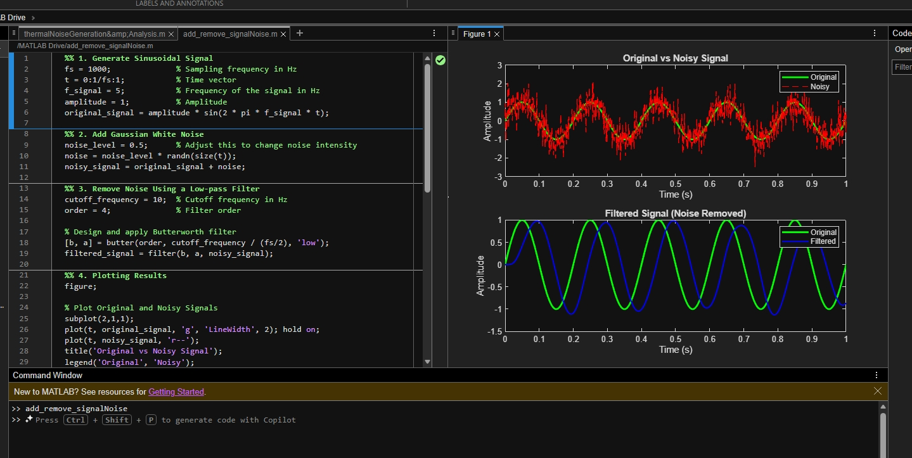

# Signal Restoration via Butterworth Low-Pass Filtering
> A MATLAB-based study on digital signal denoising, evaluating the efficacy of Butterworth filters in recovering sinusoidal components from AWGN-corrupted channels.

This project demonstrates the process of generating a sinusoidal signal, adding Gaussian white noise, and removing that noise using a low-pass Butterworth filter in MATLAB.

## Visual Results

Below is the output generated from the MATLAB simulation:

---

## Observations

1.  **Original Signal:** A clean 5Hz sine wave with an amplitude of 1.
2.  **Noisy Signal:** The addition of Gaussian white noise creates high-frequency fluctuations that obscure the original wave.
3.  **Filtered Signal:** The low-pass filter (cutoff at 10Hz) successfully removes the high-frequency noise, leaving the 5Hz signal intact.

## Evaluation

* **Noise Level:** Increasing the noise level makes the signal harder to distinguish without a more aggressive filter.
* **Cutoff Frequency:** The 10Hz cutoff is effective because it is higher than the 5Hz signal but lower than most of the noise frequencies.
* **Filter Performance:** The Butterworth filter provides a smooth response, though some slight phase lag or amplitude change may occur depending on the filter order used.

## How to Run
1. Open `signal_denoising.m` in MATLAB.
2. Run the script to generate the plots shown in the image above.
